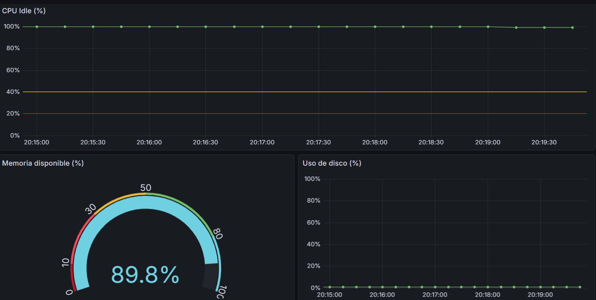

# SRE Monitoring Suite (Python)


Sistema de monitoreo local desarrollado en Python para supervisar
uso de CPU, memoria RAM y disco, con alertas automáticas,
gestión de estado para evitar alertas repetidas,tests automatizados con Github Actions y métricas conectadas a Prometheus y con visualización en Grafa.

Proyecto orientado a prácticas reales de Site Reliability Engineering:
observabilidad, alerting, automatización y respuesta a incidentes.


## Table of Contents
- Problem Statement
- Features
- Observability Stack
- Quick Start
- Architecture
- Production Readiness
- Installation
- Configuration

## Problem Statement

En muchos sistemas pequeños o personales no existe monitoreo básico.
Los problemas (disco lleno, CPU saturada, fuga de memoria) se detectan
cuando el sistema ya está degradado o caído.

Este proyecto busca:
- Detectar problemas de recursos antes del fallo
- Evitar alertas repetidas (alert fatigue)
- Enviar notificaciones claras y accionables
- Automatizar la supervisión con herramientas simples

## Features

- Monitoreo de CPU basado en idle time (top)
- Monitoreo de memoria usando memoria disponible real (free)
- Monitoreo de uso de disco por path configurable (df)
- Umbrales configurables vía variables de entorno
- Gestión de estado para detectar cambios (OK → WARNING → CRITICAL)
- Alertas y recoveries enviados a Discord
- Logs detallados por cada ejecución
- Scripts de testing manual
- Reporte diario agregado
- Limpieza automática de logs antiguos
- Tests automatizados con Pytest y Github Actions
- Métricas con Prometheus

## 📊 Visualización con Grafana

Este proyecto incluye un stack completo de observabilidad con Prometheus y Grafana para visualización de métricas en tiempo real.

### Dashboard

El dashboard muestra:
- **Uso de disco**: Gráfico de línea con tendencia temporal
- **Memoria disponible**: Gauge con thresholds de color (rojo < 20%, amarillo 20-40%, verde > 40%)
- **CPU idle**: Gráfico de línea mostrando porcentaje de CPU disponible



### Arquitectura de Observabilidad
```
┌──────────────────┐
│ metrics_exporter │ → Recolecta métricas del sistema cada 15s
└────────┬─────────┘
         │ HTTP :8000/metrics
         ↓
┌──────────────────┐
│   Prometheus     │ → Almacena time-series data
└────────┬─────────┘
         │ PromQL queries
         ↓
┌──────────────────┐
│     Grafana      │ → Visualización en dashboards
└──────────────────┘
```

### Inicio Rápido
```bash
# 1. Iniciar exporter de métricas
python3 src/metrics_exporter.py &

# 2. Iniciar Prometheus y Grafana con Docker Compose
docker-compose up -d

# 3. Acceder a los servicios
# - Métricas raw: http://localhost:8000/metrics
# - Prometheus UI: http://localhost:9090
# - Grafana: http://localhost:3000 (admin/admin)
```

### Detener servicios
```bash
# Detener Prometheus y Grafana
docker-compose down

# Detener exporter
pkill -f metrics_exporter.py
```
```

## 🏗️ Arquitectura del Código

### Patrón de Diseño

Este proyecto usa el patrón **Template Method** con una clase base `BaseCheck`:
```python
from base_check import BaseCheck

check = BaseCheck("disk")
check.validate_thresholds(80, 90)
# ... lógica específica
exit_code = check.handle_state_change(state, "Disco", "85%")
```

**Ventajas:**
- DRY (Don't Repeat Yourself)
- Fácil de extender (añadir nuevos checks)
- Lógica común centralizada
- Cada check es independiente

### Añadir un Nuevo Check

Para crear `network_check.py` (por ejemplo):

1. Importar `BaseCheck`
2. Implementar lógica específica
3. Usar `handle_state_change()` para gestionar estado
4. Listo
```python
from base_check import BaseCheck
import subprocess

check = BaseCheck("network")
# lógica aquí
result = subprocess.run(["ping", "-c", "1", "8.8.8.8"], ...)
# Determinar estado
exit_code = check.handle_state_change(state, "Latencia", "50ms")
sys.exit(exit_code)
```

## Architecture

Cada check funciona de manera independiente:

check.py
  ├── Recolecta métricas del sistema
  ├── Evalúa umbrales
  ├── Compara con el último estado
  ├── Decide si alertar o recuperar
  ├── Envía notificación
  └── Guarda el nuevo estado

El módulo notifier abstrae el envío de alertas
y permite añadir nuevos canales fácilmente.

## When to use this

- Sistemas pequeños
- Servidores personales
- Laboratorios
- Entornos sin herramientas de monitoreo dedicadas

## Production Readiness Gap Analysis

Este proyecto es educativo. Aquí está lo que cambiaría para producción real:

### ✅ Lo que YA está production-ready:

1. **State management** - Evita alertas duplicadas (crítico)
2. **Exit codes** - Siguen estándares de monitoreo
3. **Logging estructurado** - Parseable, con timestamps
4. **Separación de concerns** - Fácil mantener
5. **Métricas Históricas** - Métricas con dashboard visuales

### ⚠️ Lo que falta para producción:


1. **Secrets Management**
   - **Problema:** Webhook en archivo plano
   - **Solución:** HashiCorp Vault o AWS Secrets Manager
   - **Trade-off:** Gratis pero inseguro vs Seguro pero cuesta tiempo/$$

2. **Monitoring del Monitoring**
   - **Problema:** ¿Quién monitorea el monitor? (Deadman's switch)
   - **Solución:** Heartbeat a servicio externo cada 10 min
   - **Trade-off:** Complejidad adicional

3. **Escalamiento**
   - **Problema:** Solo monitorea 1 servidor
   - **Solución:** Agent en cada servidor + collector central
   - **Trade-off:** Funciona para aprender vs No escala

### 🎯 Priorizando:

Si tuviera que llevar esto a producción MAÑANA con tiempo limitado:

**Must-have (1-2 días):**
1. Secrets en variables de entorno (no en archivo)
2. Deadman's switch (cron job cada 10 min que hace ping a healthchecks.io)

**Nice-to-have (1 semana):**
3. Runbooks documentados

**Future (1 mes+):**
4. Multi-server support
5. Dashboard web
6. Integración con PagerDuty

### Por Qué Este Orden:

- **Secrets primero** - Vulnerabilidad de seguridad obvia
- **Deadman segundo** - "¿Quién vigila al vigilante?"

**Esta priorización NO puede hacerla una IA** - requiere entender:
- Riesgos de negocio
- Budget disponible
- Skills del equipo
- Urgencia vs importancia


## Installation

```bash
git clone https://github.com/Iriome-Santana/sre-monitoring-suite.git
cd sre-monitoring-suite
python3 -m venv venv
source venv/bin/activate
pip install -r requirements.txt


---

## 🔧 Configuration (MUY IMPORTANTE)

```md
## Configuration

Las siguientes variables de entorno controlan el comportamiento:

- WARNING: umbral de warning
- CRITICAL: umbral crítico
- DISCORD_WEBHOOK: webhook de Discord
- DISK_PATH: path a monitorear (por defecto /)
- NOTIFICATIONS_ENABLED: true/false
- METRICS_PORT = Puerto de las métricas
- SCRAPE_INTERVAL = Intervalo de tiempo en segundos para escrapear métricas

## Run manually

```bash
python src/cpu_check.py
python src/memory_check.py
python src/disk_check.py


---

## ⏱️ Automation (CRON)

```md
## Automation (cron)

Ejecutar cada 5 minutos:

```bash
*/5 * * * * python3 /path/src/cpu_check.py >> ~/sre/logs/cpu_check.log 2>&1


---

## 📊 Daily Report

```md
## Daily Report

El script `daily_report.sh` genera un resumen diario
con métricas agregadas a partir de los logs.
